# 🔐 NearBuy 인증/인가 심층 분석

> Spring Security와 JWT를 활용한 인증/인가 기능 상세 설명

**NearBuy** 프로젝트의 인증/인가 기능은 **Spring Boot**와 **Spring Security**를 기반으로 구축되었습니다.  
자체 회원가입 또는 소셜 로그인(네이버, 구글)을 지원하며, **JWT(JSON Web Token)**를 사용하여 상태 비저장(Stateless) 서버를 구현했습니다. 이 문서는 시스템의 전체적인 흐름부터 각 클래스의 역할과 내부 동작 원리까지 상세하게 설명합니다.

---

## 1. 전체 아키텍처 및 흐름 요약 🗺️
-   🔑 **설정 (`SecurityConfig`)**: 모든 보안 관련 설정의 중심입니다. CORS, 비밀번호 암호화, 필터 등록, URL별 접근 권한 등 모든 보안 관련 설정을 총괄합니다.

- 👤 **자체 로그인 (`/login`)**: `LoginFilter`가 JSON 요청을 가로채 인증을 시도하고, 성공 시 `LocalLoginSuccessHandler`가 Access/Refresh 토큰을 발급합니다.

- 🌐 **소셜 로그인 (`/oauth2/...`)**: Spring Security의 OAuth2 스택이 동작하며, `SocialLoginService`가 사용자 정보를 DB에 저장/업데이트하고, `SocialLoginSuccessHandler`가 Refresh 토큰을 **쿠키**에 담아 리다렉션합니다.

- 🔄 **토큰 교환 (`/jwt/exchange`)**: 소셜 로그인 후, 클라이언트는 쿠키의 Refresh 토큰으로 서버에 Access/Refresh 토큰을 요청합니다.

- 🛡️ **API 접근**: 클라이언트는 모든 요청 헤더에 `Authorization: Bearer <AccessToken>`을 담아 보냅니다. `JWTFilter`가 토큰을 검증하여 사용자를 인증합니다.

- ⏳ **토큰 재발급 (`/jwt/refresh`)**: Access 토큰 만료 시, 클라이언트는 Refresh 토큰으로 새로운 토큰들을 발급받습니다 (토큰 로테이션).

- 🚪 **로그아웃**: `RefreshTokenLogoutHandler`가 DB에 저장된 Refresh 토큰을 삭제하여 무효화시킵니다.

---

## 2.🌊 NearBuy 인증/인가 흐름 시퀀스 다이어그램
이 문서는 NearBuy 프로젝트의 핵심 인증/인가 흐름을 Mermaid 시퀀스 다이어그램으로 시각화하여 표현합니다.

### 2.1. 자체 로그인 흐름 (`POST /login`)

```mermaid
sequenceDiagram
    actor Client
    participant LoginFilter as "Custom<br/>LoginFilter"
    participant AuthManager as "Authentication<br/>Manager"
    participant LoginService as "LocalLoginService<br/>(UserDetailsService)"
    participant SuccessHandler as "LocalLogin<br/>SuccessHandler"
    participant JwtProvider

    Client->>+LoginFilter: 1. 로그인 요청 (POST /login)
    LoginFilter->>+AuthManager: 2. 인증 위임 (AuthenticationToken 생성)
    AuthManager->>+LoginService: 3. 사용자 정보 요청 (loadUserByUsername)
    LoginService-->>-AuthManager: 4. UserDetails 반환 (DB에서 조회)
    Note right of AuthManager: 비밀번호 비교 및 인증 수행
    AuthManager-->>-LoginFilter: 5. 인증 성공 (인증된 Auth 객체 반환)
    LoginFilter->>+SuccessHandler: 6. 성공 후처리 위임 (onAuthenticationSuccess)
    SuccessHandler->>+JwtProvider: 7. JWT 발급 요청 (issueTokens)
    JwtProvider-->>-SuccessHandler: 8. Access/Refresh Token 반환
    Note right of SuccessHandler: Handler가 Response에 직접 JWT를 작성
    SuccessHandler-->>-LoginFilter: 9. 후처리 완료 (void return)
    LoginFilter-->>-Client: 10. 최종 응답
```

### 2.2. 소셜 로그인 흐름 (`POST /login`)

```mermaid
sequenceDiagram
    actor Client
    participant SecurityFilters as "Spring Security<br/>OAuth2 Filters"
    participant SocialProvider as "Social Provider<br/>(Google/Naver)"
    participant LoginService as "SocialLoginService"
    participant SuccessHandler as "SocialLogin<br/>SuccessHandler"
    participant JwtProvider

    Client->>SecurityFilters: 1. 소셜 로그인 요청
    activate SecurityFilters
    SecurityFilters->>SocialProvider: 2. 유저 인증을 위해 리다이렉트
    SocialProvider-->>SecurityFilters: 3. 인증 완료 후 Code와 함께 콜백
    deactivate SecurityFilters
    
    Note over SecurityFilters, LoginService: Spring Security가 Code로<br/>Access Token을 받고 유저 정보를 조회

    SecurityFilters->>+LoginService: 4. 유저 정보로 loadUser 호출
    LoginService->>LoginService: 5. DB에서 유저 조회 또는 신규 생성
    LoginService-->>-SecurityFilters: 6. CustomOAuth2User 반환
    
    SecurityFilters->>+SuccessHandler: 7. 인증 성공 핸들러 호출
    SuccessHandler->>+JwtProvider: 8. Refresh Token 발급 요청
    JwtProvider-->>-SuccessHandler: 9. Refresh Token 반환
    
    Note right of SuccessHandler: Refresh Token을 HttpOnly<br/>쿠키에 담아 리다이렉트 응답 생성
    SuccessHandler-->>-Client: 10. FE로 리다이렉트 (with Cookie)
```

### 2.3. API 요청 및 인가 흐름 (JWT 사용)

```mermaid
sequenceDiagram
    actor Client
    participant JWTFilter as "Custom<br/>JWTFilter"
    participant JWTUtil
    participant SecurityContextHolder as "SecurityContext<br/>Holder"
    participant UserController

    Client->>+JWTFilter: 1. API 요청 (Header: Bearer AccessToken)
    JWTFilter->>+JWTUtil: 2. 토큰 유효성 검증 (isValid)
    JWTUtil-->>-JWTFilter: 3. 검증 결과 반환
    alt 토큰 유효
        JWTFilter->>JWTUtil: 4. 토큰에서 사용자 정보 파싱
        JWTUtil-->>JWTFilter: 5. UserPrincipal 정보 반환
        JWTFilter->>SecurityContextHolder: 6. 인증 정보 저장 (setAuthentication)
        JWTFilter->>+UserController: 7. 요청 계속 처리
        Note right of UserController: @AuthenticationPrincipal로<br/>UserPrincipal 정보 사용
        UserController-->>-Client: 8. API 응답
    else 토큰 유효하지 않음
        JWTFilter-->>Client: 요청 차단 (Error or 401/403)
    end
    deactivate JWTFilter
```

### 2.4. JWT 재발급 흐름 (토큰 로테이션)

```mermaid
sequenceDiagram
    actor Client
    participant JwtController
    participant JwtService
    participant JWTUtil
    participant RefreshRepository as "Refresh<br/>Repository"

    Client->>+JwtController: 1. 토큰 재발급 요청 (POST /jwt/refresh)
    JwtController->>+JwtService: 2. 재발급 로직 호출 (refreshRotate)
    
    JwtService->>JWTUtil: 3. Refresh Token 유효성 검증
    JWTUtil-->>JwtService: 4. 검증 결과 반환
    
    JwtService->>RefreshRepository: 5. DB에 토큰 존재 여부 확인
    RefreshRepository-->>JwtService: 6. 확인 결과 반환
    
    alt 토큰 유효하고 DB에 존재
        JwtService->>JWTUtil: 7. 신규 Access/Refresh Token 생성
        JWTUtil-->>JwtService: 8. 신규 토큰 반환
        JwtService->>RefreshRepository: 9. 기존 Refresh Token 삭제
        JwtService->>RefreshRepository: 10. 신규 Refresh Token 저장
    end
    
    JwtService-->>-JwtController: 11. 처리 결과 DTO 반환
    JwtController-->>-Client: 12. 신규 토큰 또는 에러 응답 (JSON)
```

---

## 3. 주요 흐름 상세 분석 🌊

### **3.1. 자체 회원가입 및 로그인 흐름**

#### **3.1.1. 회원가입 (`POST /user/join`)**

1.  **`UserController`**: `@PostMapping("/join")`으로 매핑된 `joinApi` 메서드가 `UserJoinRequestDto`를 `@RequestBody`로 받습니다. `@Validated` 어노테이션으로 DTO에 정의된 유효성 검사(ID, PW 형식 등)가 먼저 수행됩니다.
2.  **`UserService.join()`**:
    -   `validateJoinRequest` 메서드를 호출하여 비즈니스 로직 상의 유효성을 검증합니다.
        -   비밀번호와 비밀번호 확인 필드가 일치하는지 확인합니다.
        -   `userRepository.existsByUsername`를 통해 이미 존재하는 아이디인지 확인합니다.
    -   `passwordEncoder.encode()`를 호출하여 사용자의 평문 비밀번호를 BCrypt 해시로 변환합니다.
    -   검증된 정보와 암호화된 비밀번호로 `UserEntity`를 생성하고, `userRepository.save()`를 통해 데이터베이스에 저장합니다.

#### **3.1.2. 로그인 (`POST /login`)**

1.  **`LoginFilter.attemptAuthentication()`**: `UsernamePasswordAuthenticationFilter`보다 먼저 동작하도록 `SecurityConfig`에 설정되어 있습니다.
    -   `POST /login` 요청을 가로챕니다. 기본 필터는 `form-data`만 처리하므로, `application/json` 요청을 처리하기 위해 커스텀 필터를 사용합니다.
    -   `ObjectMapper`를 사용해 `request.getInputStream()`에서 JSON 데이터를 `LoginRequestDto`로 변환합니다.
    -   DTO에서 얻은 `username`과 `password`로 `UsernamePasswordAuthenticationToken` (인증 전 토큰)을 생성합니다.
    -   이 토큰을 `getAuthenticationManager().authenticate()`에 전달하여 인증 프로세스를 시작시킵니다.
2.  **`AuthenticationManager` (ProviderManager 구현체)**:
    -   등록된 `AuthenticationProvider` 중에서 `UsernamePasswordAuthenticationToken`을 처리할 수 있는 `DaoAuthenticationProvider`를 선택합니다.
3.  **`LocalLoginService.loadUserByUsername()`**: `DaoAuthenticationProvider`는 주입된 `UserDetailsService` 구현체인 `LocalLoginService`의 이 메서드를 호출합니다.
    -   `userRepository.findByUsernameAndIsLockAndIsSocial()`을 통해 DB에서 잠기지 않은, 비-소셜 계정 정보를 조회합니다.
    -   조회된 `UserEntity` 정보를 바탕으로 Spring Security가 사용하는 `org.springframework.security.core.userdetails.User` 객체(UserDetails 구현체)를 생성하여 반환합니다. 이 객체에는 DB에 저장된 해시된 비밀번호가 포함됩니다.
4.  **`DaoAuthenticationProvider`**:
    -   `LocalLoginService`로부터 받은 `UserDetails`의 비밀번호(DB 값)와, `LoginFilter`가 생성한 토큰에 담겨있던 평문 비밀번호를 `passwordEncoder.matches()`를 통해 비교합니다.
    -   인증에 성공하면, 사용자 정보와 권한(`GrantedAuthority`)이 포함된 `UsernamePasswordAuthenticationToken` (인증 후 토큰)을 생성하여 반환합니다.
5.  **`LocalLoginSuccessHandler.onAuthenticationSuccess()`**: 인증이 최종 성공하면 이 핸들러가 호출됩니다.
    -   `authentication.getName()`으로 인증된 사용자의 `username`을 가져옵니다.
    -   `userRepository`에서 다시 사용자 정보를 조회하여 `id`, `username`, `role`을 확보합니다.
    -   `jwtProvider.issueTokens()`를 호출하여 **Access Token**과 **Refresh Token**을 모두 발급받습니다.
    -   `ResponseWriterUtil.writeJson()`을 통해 발급된 토큰들을 JSON 형태로 클라이언트에게 응답합니다.

### **3.2. 소셜 로그인 흐름**

1.  **OAuth2 로그인 시작**: 클라이언트가 `GET /oauth2/authorization/google` 같은 링크로 요청하면, Spring Security의 `OAuth2AuthorizationRequestRedirectFilter`가 이를 가로채 구글 로그인 페이지로 리다이렉트합니다.
2.  **인증 및 리다이렉션**: 사용자가 구글에서 로그인을 완료하면, 구글은 `authorization code`와 함께 사전에 등록된 `redirect-uri`로 사용자를 다시 리다이렉트시킵니다.
3.  **토큰 교환 및 사용자 정보 조회**: Spring Security의 `OAuth2LoginAuthenticationFilter`가 `authorization code`를 받아 구글에 Access Token을 요청하고, 받은 Access Token으로 다시 사용자 정보를 요청합니다.
4.  **`SocialLoginService.loadUser()`**: `DefaultOAuth2UserService`를 상속받은 이 커스텀 서비스가 호출됩니다.
    -   `parseSocialUserAttributes` 메서드를 통해 제공자(네이버, 구글)별로 상이한 응답 포맷을 `SocialUserAttributes`라는 표준화된 record 객체로 파싱합니다. 예를 들어, 구글의 고유 ID는 `sub` 필드에서, 네이버는 `response` 객체 안의 `id` 필드에서 가져옵니다.
    -   `processSocialUser` 메서드에서 파싱된 정보로 `userRepository.findByUsernameAndIsSocial(username, true)`를 호출하여,
        -   **기존 회원이면**: `existingUser.updateUser()`를 통해 이메일, 닉네임 등 최신 정보로 업데이트합니다.
        -   **신규 회원이면**: `UserEntity`를 새로 생성하여 DB에 저장합니다. 소셜 로그인 사용자는 비밀번호가 없으므로 빈 문자열로 설정됩니다.
    -   인증된 사용자 정보를 담은 `CustomOAuth2User` 객체를 생성하여 반환합니다.
5.  **`SocialLoginSuccessHandler.onAuthenticationSuccess()`**: 인증 성공 시 호출됩니다.
    -   인증된 `CustomOAuth2User` 객체에서 `UserPrincipal`을 추출합니다.
    -   `jwtProvider.issueRefreshToken()`을 호출하여 **Refresh Token만** 발급하고 DB에 저장합니다. Access Token은 브라우저 주소창에 노출될 수 있으므로 발급하지 않습니다.
    -   발급된 Refresh Token을 `HttpOnly`, `Secure` 속성이 적용된 **쿠키**에 담아 `response.addCookie()`로 추가합니다.
    -   클라이언트를 프론트엔드 주소(`http://localhost:5173/cookie`)로 리다이렉트시킵니다. 이 페이지는 쿠키를 읽어 다음 단계인 토큰 교환을 요청하는 로직을 수행하게 됩니다.

### **3.3. API 요청 인가(Authorization) 흐름**

1.  **`JWTFilter.doFilterInternal()`**: 모든 요청에 대해 한 번씩 실행됩니다.
    -   `resolveToken` 메서드를 통해 `request.getHeader("Authorization")` 값을 읽고, "Bearer " 접두사를 확인하고 제거하여 순수한 Access Token을 추출합니다.
    -   `JWTUtil.isValid(accessToken, true)`를 호출하여 토큰을 검증합니다.
        -   서명이 유효한지, 만료되지 않았는지 `jjwt` 라이브러리가 확인합니다.
        -   토큰의 `type` 클레임이 "access"가 맞는지 추가로 확인합니다.
    -   토큰이 유효하면, `setAuthentication` 메서드가 실행됩니다.
        -   `JWTUtil`을 사용해 토큰에서 `id`, `username`, `role` 클레임을 파싱합니다.
        -   이 정보로 `UserPrincipal` 객체를 생성합니다. 이 커스텀 객체는 컨트롤러에서 `@AuthenticationPrincipal`로 직접 주입받을 수 있어 편리합니다.
        -   `UserPrincipal`과 권한 정보를 담아 `UsernamePasswordAuthenticationToken` (인증 후 토큰)을 생성합니다.
        -   `SecurityContextHolder.getContext().setAuthentication()`을 통해 현재 스레드의 `SecurityContext`에 인증 정보를 저장합니다. 이제 이 요청은 '인증된 상태'가 됩니다.
2.  **인가 처리**: `JWTFilter` 이후의 필터 체인에서 `AuthorizationFilter` 등이 `SecurityContextHolder`의 인증 정보를 바탕으로 `SecurityConfig`에 정의된 `authorizeHttpRequests` 규칙을 확인하여 최종적으로 API 접근 허용/거부를 결정합니다.

### **3.4. JWT 토큰 재발급 흐름 (`POST /jwt/refresh`)**

1.  **`JwtController`**: `/refresh` 엔드포인트에서 `RefreshRequestDto`를 받습니다.
2.  **`JwtService.refreshRotate()`**:
    -   DTO에서 Refresh Token을 꺼내 `JWTUtil.isValid(refreshToken, false)`로 유효성을 검증합니다 (타입이 "refresh"인지 확인).
    -   `refreshRepository.existsByRefresh()`를 통해 DB에 해당 토큰이 실제로 저장되어 있는지 확인합니다.
    -   유효하다면, 토큰에서 `id`, `username`, `role` 정보를 추출하여 **새로운 Access Token과 새로운 Refresh Token을 모두 생성**합니다.
    -   `removeRefresh(refreshToken)`를 호출하여 기존 Refresh Token을 DB에서 삭제합니다.
    -   새로 생성된 Refresh Token을 `refreshRepository.save()`를 통해 DB에 저장합니다. 이 과정을 **Refresh Token Rotation**이라고 하며, Refresh Token 탈취 시 피해를 최소화하는 중요한 보안 전략입니다.
    -   두 개의 새로운 토큰을 `JWTResponseDto`에 담아 클라이언트에게 응답합니다.

### **3.5. 로그아웃 흐름**

1.  **Logout 요청**: 클라이언트가 로그아웃을 요청하면, `SecurityConfig`에 설정된 `logout` 프로세스가 시작됩니다.
2.  **`RefreshTokenLogoutHandler.logout()`**: 커스텀 핸들러가 실행됩니다.
    -   `ObjectMapper`를 사용해 요청 본문에서 `LogoutRequestDto`를 파싱하여 Refresh Token을 추출합니다.
    -   `jwtService.removeRefresh(refreshToken)`을 호출합니다.
3.  **`JwtService.removeRefresh()`**: `refreshRepository.deleteByRefresh(refreshToken)`을 실행하여 DB에서 해당 Refresh Token을 삭제합니다. 이로써 해당 토큰은 더 이상 토큰 재발급에 사용할 수 없게 되어 완전히 무효화됩니다.

---

## 4. 핵심 클래스 심층 분석 🧩

-   ⚙️ **`config.SecurityConfig`**
    -   **역할**: Spring Security의 모든 설정을 총괄하는 클래스. ` @EnableWebSecurity`를 통해 활성화됩니다.
    -   **주요 설정**:
        -   `securityFilterChain()`: HTTP 요청에 대한 보안 규칙을 정의하는 핵심 메서드입니다.
            -   `.csrf(AbstractHttpConfigurer::disable)`: JWT는 상태를 저장하지 않으므로 CSRF 보호가 불필요하여 비활성화합니다.
            -   `.sessionManagement(session -> session.sessionCreationPolicy(SessionCreationPolicy.STATELESS))`: 세션을 사용하지 않는 상태 비저장 서버임을 명시합니다.
            -   `.authorizeHttpRequests(...)`: URL 패턴별로 접근 권한을 세밀하게 설정합니다. `.requestMatchers("/login").permitAll()`은 `/login` 경로를 모두에게 허용하고, `.requestMatchers(HttpMethod.GET, "/user").hasRole("USER")`는 USER 역할을 가진 사용자만 GET /user 요청을 허용합니다.
            -   `.addFilterBefore(...)`: `JWTFilter`와 `LoginFilter` 같은 커스텀 필터를 Spring Security의 기본 필터 체인의 특정 위치에 삽입합니다. 필터의 순서는 매우 중요합니다.

-   🛠️ **`auth.web.util.JWTUtil`**
    -   **역할**: JWT의 생성, 파싱, 유효성 검증 등 저수준(low-level) 로직을 처리하는 유틸리티.
    -   **주요 기능**:
        -   **`secretKey`**: 토큰 서명에 사용할 비밀키를 `static` 블록에서 `SecretKeySpec`을 사용하여 초기화합니다.
        -   **`createJWT`**: `Jwts.builder()`를 사용하여 토큰을 생성합니다. `claim()` 메서드로 페이로드에 `id`, `sub`(username), `role`, `type` 등 커스텀 데이터를 추가하고, `issuedAt()`, `expiration()`으로 발급/만료 시간을 설정한 뒤 `signWith()`으로 서명합니다.
        -   **`isValid`**: `Jwts.parser().verifyWith(secretKey).build().parseSignedClaims(token)`를 통해 토큰을 검증합니다. 서명 위조, 만료, 형식 오류 등이 발생하면 `JwtException`이 발생하며, 이를 `catch`하여 `false`를 반환합니다.

-   🎟️ **`auth.token.provider.JwtProvider` vs `auth.token.service.JwtService`**
    -   **역할 분리**: 두 클래스는 토큰 관련 책임을 명확히 분리합니다.
    -   **`JwtProvider`**: 토큰을 **생성(발급)**하는 역할(Factory)을 합니다. `JWTUtil`을 사용하여 토큰 문자열을 만들고, `JwtService`를 호출하여 Refresh Token의 **저장**을 위임합니다.
    -   **`JwtService`**: Refresh Token의 **생명주기 관리**를 담당합니다. DB CRUD(`addRefresh`, `removeRefresh`), 쿠키 변환(`cookie2Header`), 토큰 재발급(`refreshRotate`) 등 비즈니스 로직을 처리합니다.

-   🧑‍💼 **`user.service.UserService` vs `user.service.LocalLoginService`**
    -   **역할 분리**: 사용자 관련 서비스도 역할이 분리되어 있습니다.
    -   **`UserService`**: 회원가입, 정보 수정, 탈퇴 등 **일반적인 사용자 관리(CRUD)** 비즈니스 로직을 담당합니다.
    -   **`LocalLoginService`**: Spring Security의 `UserDetailsService` 인터페이스를 구현하여, **오직 인증 과정에서 사용자 정보를 조회**하는 역할만 수행합니다. Spring Security와의 계약을 지키기 위한 어댑터(Adapter) 클래스입니다.